# Copyright (c) 2002-2019 by Symas Corporation
# All rights reserved.

# Configure VirtualBox Demo Environment

## Copy all files from the flash drive provided to your computer.

## Install VirtualBox

1. From the files copied to your computer, double-click on the VirtualBox install file for your platform
2. Follow the prompts to install VirtualBox

## Create New VM

1. Launch VirtualBox

2. Click on New button:

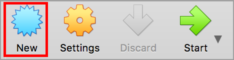

3. Create a name for your virtual machine, select "Linux," select "Other 64-bit," then click Continue:

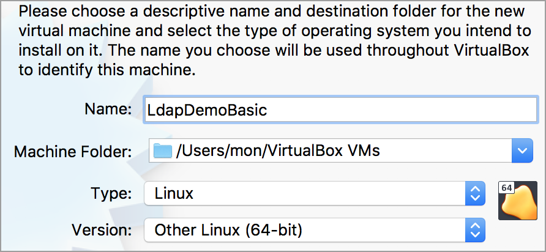

4. Change Memory size to 1024mb by typing in the size box or using the slider tool, then click Continue:

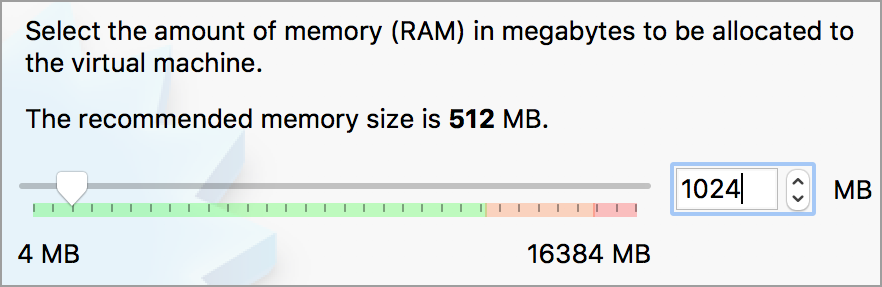

5. Keep the selection of "Create a virtual hard disk now," then click Create:

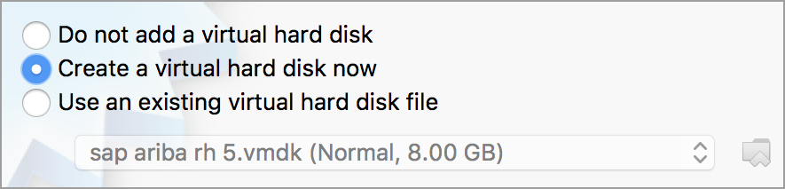

6. Keep the selection of "VDI (VirtualBox Disk Image)," then click Continue:

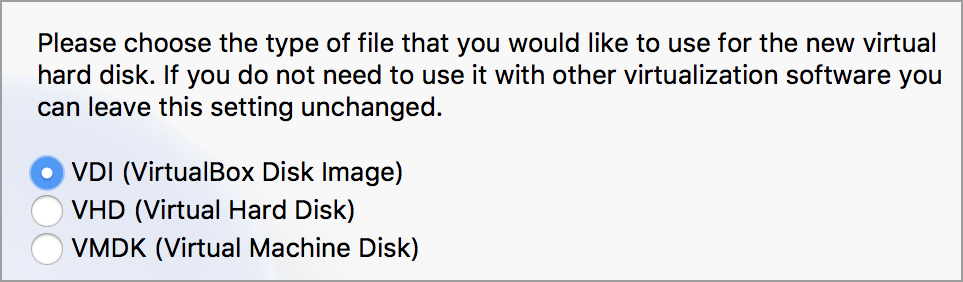

7. Keep the selection of "Dynamically allocated," then click Continue:

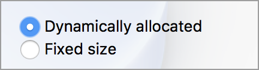

8. Change the virtual hard disk size from 8.00 to 20, either by typing directly or using the slider bar, then click Create:

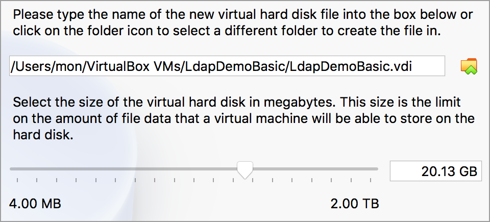

9. Once the VM has been created, select the VM to highlight it, then click the start button:

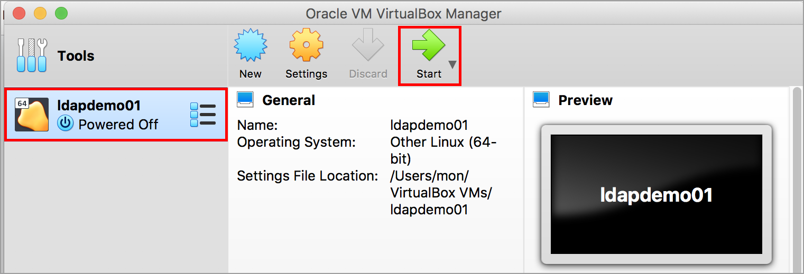

10. The next step allows you to connect the Centos 7 image (provided on the flash drive) to this VM. Click on the folder icon next to the dropdown,
and navigate to the location of the Centos 7 image, select it, then click the Start button:

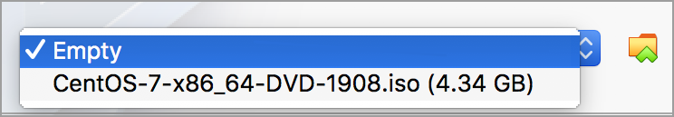

11. Click Enter to start the install of Centos 7. You can click on Settings in the VirtualBox toolbar, click on "Display", then set the scale factor
to 250% to make the screen larger:

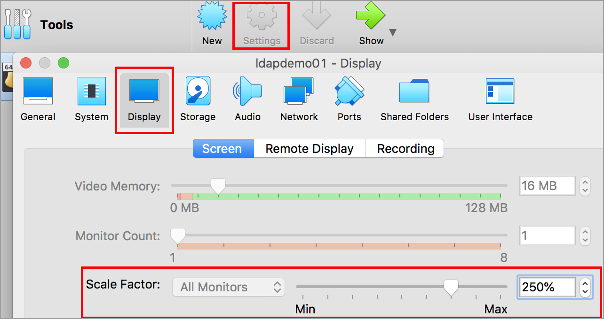

12. The install process will pause on the language selection screen. Select your language and click Continue:

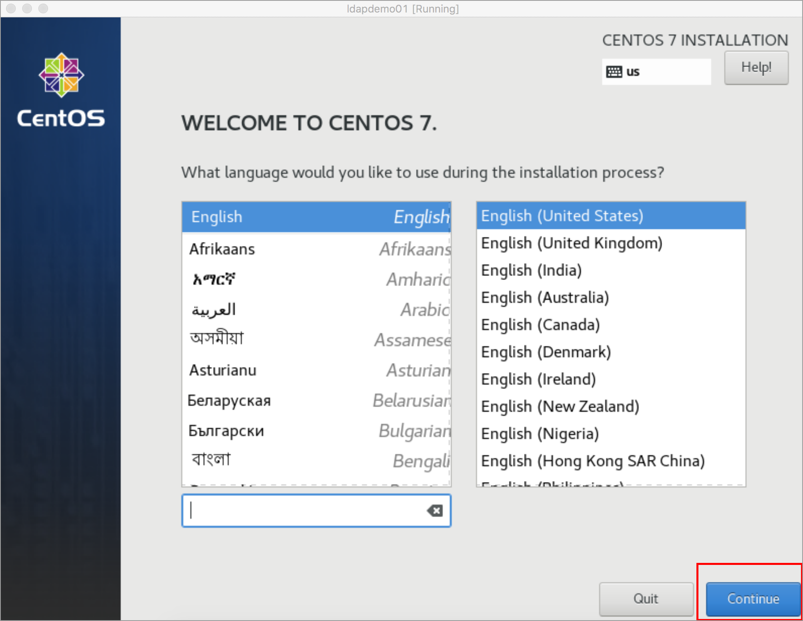

13. On the installation summary screen, the installation destination has to be specified, so click on Installation Destination:

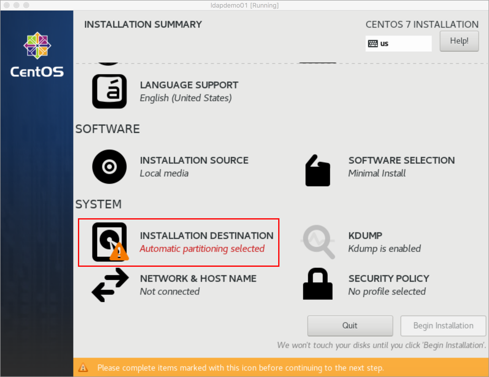

14. On the Device Selection screen, click on the ATA VBOX HARDDISK icon:

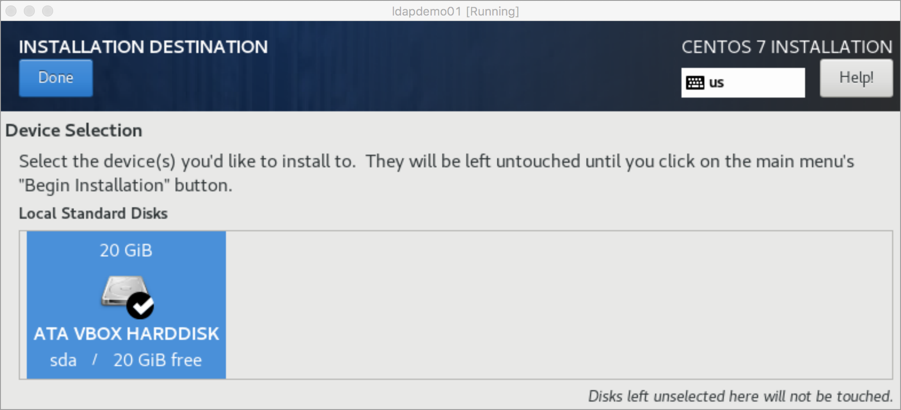

15. Installation Source will now say "Automatic partioning selected":

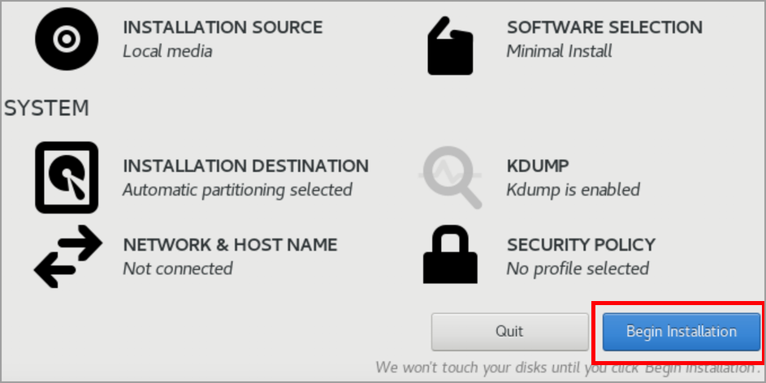

16. Next step will be to set up the network configuration, so click on "Network & Host Name":

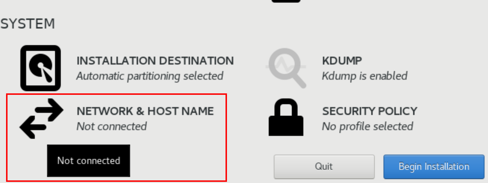

17. Click the toggle switch to enable network connectivity, then click Done:

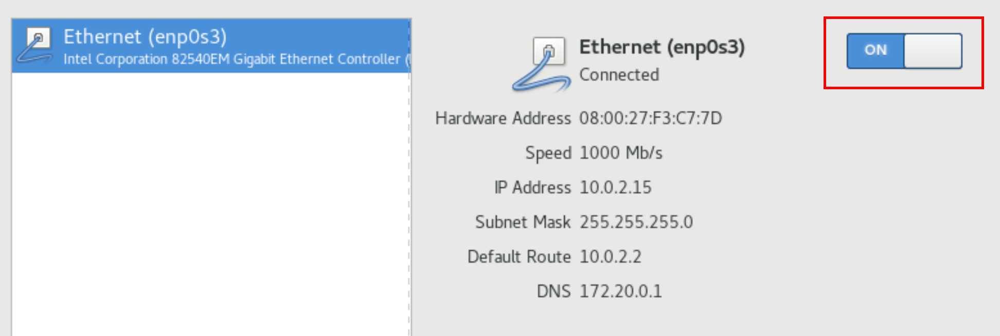

18. Click Begin Installation:

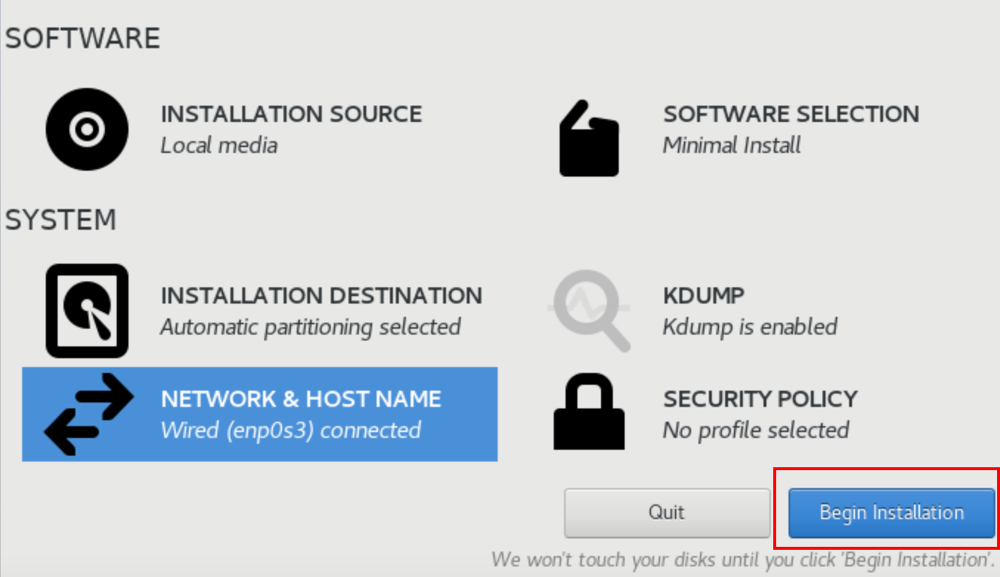

19. While the installation of Centos 7 continues, set the root password and set up a first user account:

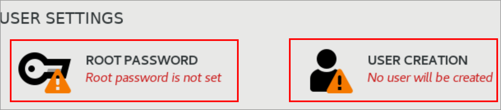

20. After the installation has been completed, you need to reboot the VM:

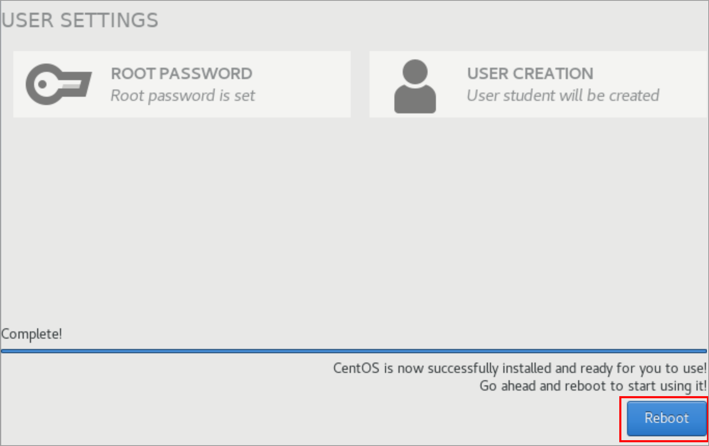

21. This brings you to the login screen:

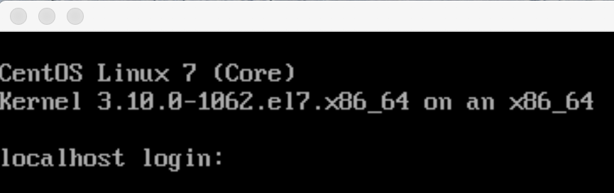

22. To shutdown your new VM, click on Machine in the toolbar, then ACPI-Shutdown:

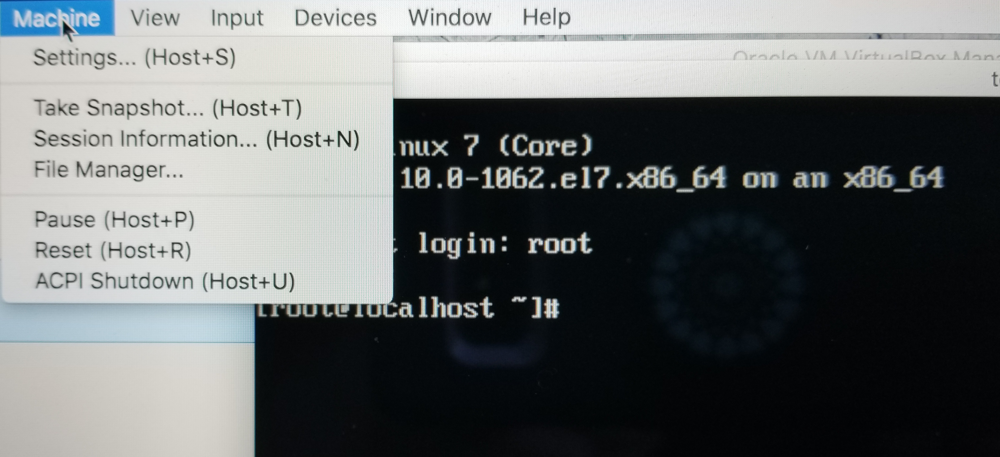
