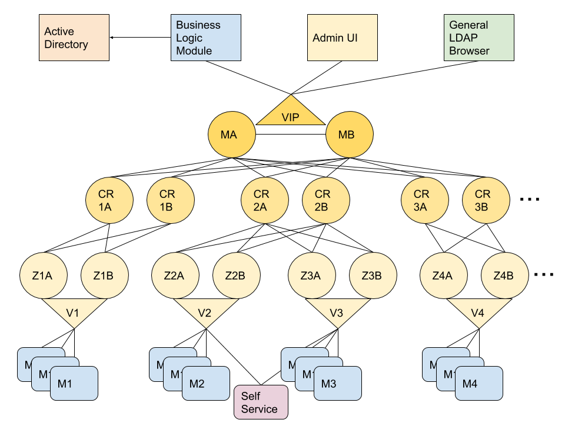

# README for OpenLDAP MMR Replication project

 Target Architecture
 

## Follow these steps:

### 1. Prepare Virtual Box (or vmware)

[README-configure-vb-demo-env](README-IMPORT-VM.md)

### 2. Install OpenLDAP Masters

[README-MASTERS](./README-MASTERS.md)

### 3. Install OpenLDAP Replicas

[README-REPLICAS](./README-REPLICAS.md)
